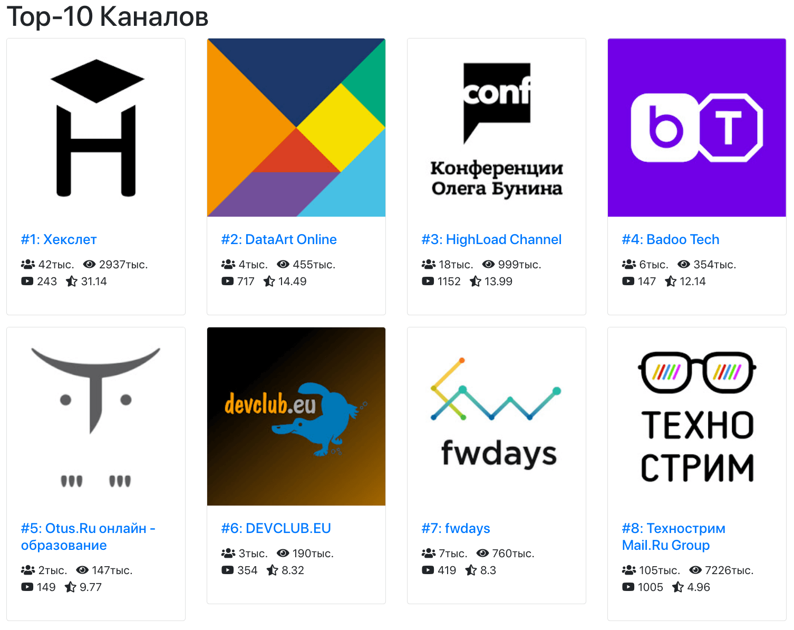
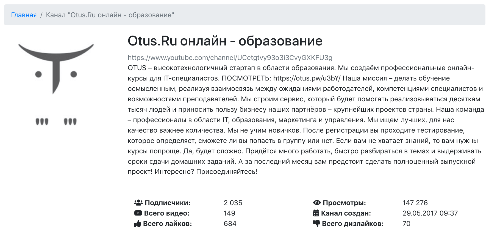

# YouTube Analytic

Проект состоит из двух частей: консольных команд для добавления статистики по youtube-каналам и web-интерфейса
для отображения общих и аггрегированных данных по каналам. В качестве основного хранилища используется MongoDB.
Домашнее задание для урока №15 специально для курса Otus.

## Скриншоты

Top-10 каналов по соотношению лайков и дизлайков (rate):


Информация о канале и аггрегированная статистика:


## Структура Mongo коллекций

### Channel
```
|-- _id                     Mongo идентификатор
|-- channel_id              ID канала (из YouTube)
|-- title                   Название канала
|-- description             Описание
|-- slug                    URL (есть не у всех каналов)
|-- thumbnails              Лого канала (в разных разрешениях)
|   |-- default
|   |   |-- url
|   |   |-- width
|   |   |-- height
|   |-- medium
|   |   |-- url
|   |   |-- width
|   |   |-- height
|   |-- high
|   |   |-- url
|   |   |-- width
|   |   |-- height
|-- statistics              Статистика канала (собрана YouTub`ом)
|   |-- view_count          Общее кол-во просмотров по всем видео
|   |-- video_count         Общее кол-во видео
|   |-- subscriber_count    Кол-во подписчиков
```

### Videos
```
|-- _id                     Mongo идентификатор
|-- channel_id              ID канала (из YouTube)
|-- video_id                ID видео (из YouTube)
|-- title                   Название видео
|-- description             Описание
|-- published_at            Дата публикации
|-- thumbnails              Превью видео-ролика (в разных разрешениях)
|   |-- default
|   |   |-- url
|   |   |-- width
|   |   |-- height
|   |-- medium
|   |   |-- url
|   |   |-- width
|   |   |-- height
|   |-- high
|   |   |-- url
|   |   |-- width
|   |   |-- height
|   |-- standard
|   |   |-- url
|   |   |-- width
|   |   |-- height
|   |-- maxres
|   |   |-- url
|   |   |-- width
|   |   |-- height
|-- statistics              Статистика видео (собрана YouTub`ом)
|   |-- view_count          Кол-во просмотров
|   |-- like_count          Кол-во лайков
|   |-- dislike_count       Кол-во дизлайков
|   |-- comment_count       Кол-во комментариев
|   |-- favorite_count      Кол-во добавлений видео в избранное
```
